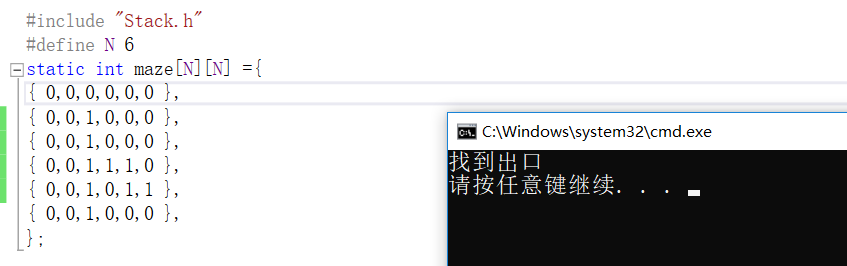
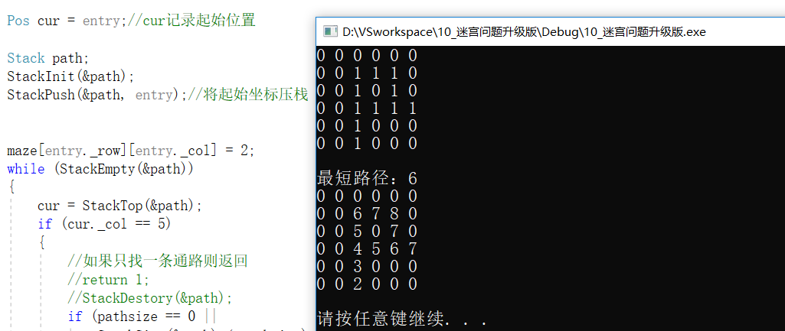

# 迷宫问题的几个版本，难度逐步增加

## 简单迷宫
* 现将入口点压栈，走过的地方标记为2
* 每走一步就将坐标压栈，判断下一步可以走的地方，如果能走就压栈
* 当上下左右四个方向都不能走的时候就回溯
* 直到回溯到入口点还是没有其他方向可以走，那么循环结束，也就意味着没有出口！
* 使用一个方法判断坐标点是否合法的，注意数组越界的情况，首先不越界，其次坐标点值为1的时候才是合法的

## 多通路迷宫：通路间不带环
* 首先需要明白当右边出现两个入口点的时候只需要判断`列 == N`即可认为是找到了出口
## 多通路迷宫：通路间带环
* 首先下一个点可以走的条件是：该点值为1或者该点值比上一个+1还大
* 每走一步值就+1，入口点值设置为2

